  

#  About Me
Hey, I’m **Al Farhana Siddique** 

I’m a Software Engineering graduate from the University of Calgary who likes building practical projects, experimenting with new tools, and spending way too much time figuring out why something is not working.

I enjoy digging through unfamiliar code, tracking down bugs, and improving systems once I understand how all the pieces fit together. This profile is where I share some of the projects, experiments, and things I’ve worked on along the way.

I’ve also been involved with **ZOO**, the Electrical and Software Engineering Students’ Society, and the **Schulich Space Rover Team**.

Outside of coding, I’m usually baking, taking care of my plants, listening to crime podcasts, or hiking during Calgary’s very short summer.

---

## 💻 Tech Stack

---

##  Featured Projects
| Project | Description | Tech Stack |
|--------|-------------|------------|
| **Automated Data-driven Animal Parameter Tuning (Capstone)** | Structured testing strategy for the RSO system covering GUI workflows, backend APIs, machine learning integration, and hardware communication; 300+ GUI test cases | Python, Pytest, Pytest-qt, Git, CI/CD |
| **Personality Shift Simulator** | Machine learning system predicting personality type and behavioral changes from simulated lifestyle interventions | PyTorch, Scikit-learn, Pandas, NumPy, Jupyter |
| **Obituary Portal** | Full-stack app with React frontend and AWS backend, integrating ChatGPT, Amazon Polly, and Cloudinary APIs | React, Node.js, AWS Lambda, Terraform, Netlify |

 Explore all repositories -> **https://github.com/alfarhana25?tab=repositories**

  

